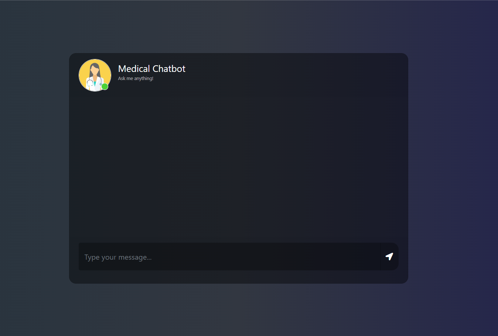
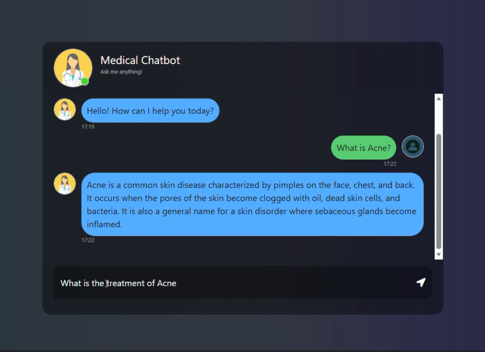

# 🩺 Medical-Chatbot

An AI-powered **Medical Chatbot** built using **Flask, LangChain, Pinecone, HuggingFace Embeddings, and Gemini**.
This project uses a **Retrieval-Augmented Generation (RAG)** pipeline to answer medical questions from a custom medical knowledge base created from PDF documents.

---

## 📌 About the Project

**Medical-Chatbot** is a web-based chatbot that answers medical queries using a **RAG (Retrieval-Augmented Generation)** workflow.

Instead of relying only on a general LLM response, the system first retrieves relevant information from a medical document knowledge base stored in a vector database, then generates an answer grounded in that retrieved context. This makes the responses more relevant, domain-specific, and useful for educational medical Q&A.

### Key highlights

* 📄 Load medical PDF files as a knowledge source
* ✂️ Split documents into semantic chunks
* 🧠 Generate embeddings using HuggingFace sentence transformers
* 🗂️ Store and retrieve vectors using Pinecone
* 🤖 Generate final answers using Gemini through LangChain
* 🌐 Chat with the bot using a Flask-based web interface

---

# 🖼️ Homepage Preview


<p align="center">
  
</p>


---

# 🎥 Demo Video

https://github.com/user-attachments/assets/3279b712-2069-4780-aaeb-16d0f40908b5

---

## 🚀 Features

* 🩺 **Medical Question Answering**

  * Ask health-related questions in natural language
  * Get concise answers based on retrieved medical document context

* 📚 **RAG-Based Retrieval Pipeline**

  * Loads medical PDFs from the `data/` folder
  * Splits them into chunks
  * Converts chunks into embeddings
  * Stores embeddings in Pinecone

* 🔎 **Semantic Search**

  * Retrieves top relevant chunks for each query
  * Helps reduce hallucinations by grounding answers in source documents

* 🤖 **Gemini-Powered Answer Generation**

  * Uses **Google Gemini** via LangChain for final response generation

* 🌐 **Simple Chat UI**

  * Flask-powered web application
  * Bootstrap + HTML/CSS based chat interface

* 🧩 **Modular Codebase**

  * Separate helper functions for ingestion and embeddings
  * Separate prompt management
  * Separate indexing script for vector DB creation

---

## 🏗️ System Architecture

The project follows this **RAG pipeline**:

1. **Load PDF documents** from the `data/` folder
2. **Extract text** from the PDFs
3. **Split text into chunks**
4. **Generate embeddings** using HuggingFace Sentence Transformers
5. **Store vectors in Pinecone**
6. **Retrieve relevant chunks** for the user’s question
7. **Pass retrieved context + query** to Gemini through LangChain
8. **Return the generated response** in the Flask chat UI

---

## 🛠️ Tech Stack

| Category                 | Technologies                                           |
| ------------------------ | ------------------------------------------------------ |
| **Backend**              | Python, Flask                                          |
| **LLM Orchestration**    | LangChain                                              |
| **Vector Database**      | Pinecone                                               |
| **Embeddings**           | HuggingFace Sentence Transformers (`all-MiniLM-L6-v2`) |
| **LLM**                  | Google Gemini                                          |
| **Frontend**             | HTML, CSS, Bootstrap, jQuery                           |
| **Document Loading**     | PyPDF, LangChain DirectoryLoader                       |
| **Environment Handling** | python-dotenv                                          |

---

## 📁 Project Structure

```bash
Medical-Chatbot/
│
├── data/                          # Medical PDF files used as knowledge base
│
├── src/
│   ├── __init__.py
│   ├── helper.py                  # PDF loading, chunking, and embeddings helpers
│   └── prompt.py                  # System prompt for the chatbot
│
├── static/
│   └── style.css                  # Chat UI styling
│
├── templates/
│   └── chat.html                  # Flask chat interface
│
├── app.py                         # Main Flask application
├── store_index.py                 # Script to create/store embeddings in Pinecone
├── requirements.txt               # Project dependencies
├── setup.py                       # Package setup file
├── README.md
└── LICENSE
```

---

# ⚙️ Getting Started

## 1) Clone the Repository

```bash
git clone "https://github.com/anaydeshpande1749/Medical-Chatbot.git"
cd Medical-Chatbot
```

---

## 2) Create a Conda Environment

```bash
conda create -n medibot python=3.10 -y
conda activate medibot
```

---

## 3) Install the Requirements

```bash
pip install -r requirements.txt
```

---

## 4) Create a `.env` File

Create a `.env` file in the **root directory** and add your credentials:

```ini
PINECONE_API_KEY="xxxxxxxxxxxxxxxxxxxxxxxxxxxxx"
OPENAI_API_KEY="xxxxxxxxxxxxxxxxxxxxxxxxxxxxx"
```

> **Note:** In the current project code, the Gemini / Google API key is being read from `OPENAI_API_KEY`.
> You can keep it like this for now, or later rename it to something like `GOOGLE_API_KEY` for clarity.

---

## 5) Add Medical PDF Files

Place your medical PDF documents inside the `data/` folder.
These PDFs will be used as the chatbot’s knowledge base.

Example:

```bash
data/
├── medical_book_1.pdf
├── disease_guide.pdf
└── symptoms_reference.pdf
```

---

## 6) Store Embeddings in Pinecone

Run the following command to load the PDFs, split them into chunks, generate embeddings, and upload them to Pinecone:

```bash
python store_index.py
```

---

## 7) Run the Flask App

```bash
python app.py
```

Now open:

```bash
http://localhost:8080
```

---

# 💬 Usage

1. Open the chatbot in your browser
2. Type a medical question into the input box
3. The chatbot retrieves relevant medical chunks from Pinecone
4. Gemini generates an answer based on the retrieved context
5. The response is shown in the chat interface

### Example questions

* What are the symptoms of diabetes?
* What causes hypertension?
* How is asthma treated?
* What are the signs of anemia?
* What is the treatment for pneumonia?

---

# 🧠 Core Components

## `app.py`

Main Flask application that:

* loads environment variables
* connects to the Pinecone index
* creates the retriever
* initializes Gemini through LangChain
* runs the RAG chain
* serves the chatbot UI

---

## `store_index.py`

Responsible for:

* loading PDF files from `data/`
* filtering and preparing documents
* splitting text into chunks
* generating embeddings
* creating / using a Pinecone index
* storing vectors in Pinecone

---

## `src/helper.py`

Contains helper functions for:

* loading PDFs
* reducing metadata
* splitting text into chunks
* downloading / initializing HuggingFace embeddings

Main helper functions:

* `load_pdf_file(data)`
* `filter_to_minimal_docs(docs)`
* `text_split(extracted_data)`
* `download_hugging_face_embeddings()`

---

## `src/prompt.py`

Contains the system prompt used by the chatbot.
It instructs the model to:

* act like a medical assistant
* answer using retrieved context
* stay concise
* avoid fabricating answers if the answer is not present in the retrieved documents

---

# 📸 Screenshots

You can later add more screenshots like this:

## Chat Interface


## Example Conversation



---

# 🔄 Example Flow

```text
User Query
   ↓
Flask App
   ↓
Pinecone Retriever
   ↓
Relevant Medical Chunks Retrieved
   ↓
LangChain Prompt + Gemini Model
   ↓
Generated Response
   ↓
Displayed in Chat UI
```

---

# ⚠️ Important Disclaimer

This project is intended for **educational, learning, and research purposes only**.

It is **not a substitute for professional medical advice, diagnosis, or treatment**.
Always consult a qualified healthcare professional for real medical concerns.

---

# ☁️ AWS CI/CD Deployment with GitHub Actions

This section describes the deployment workflow for hosting the project using **AWS + Docker + GitHub Actions**.

## 1. Login to AWS Console

Open the AWS Console and sign in to your account.

---

## 2. Create an IAM User for Deployment

Create an IAM user with programmatic access and the required permissions.

### Required access

1. **EC2 Access** – for launching and managing the virtual machine
2. **ECR Access** – for storing the Docker image in AWS Elastic Container Registry

### Deployment workflow overview

1. Build the Docker image from the source code
2. Push the Docker image to **Amazon ECR**
3. Launch an **EC2** instance
4. Pull the Docker image from ECR inside EC2
5. Run the Docker container on EC2

### Recommended IAM Policies

* `AmazonEC2ContainerRegistryFullAccess`
* `AmazonEC2FullAccess`

---

## 3. Create an ECR Repository

Create an ECR repository to store the Docker image.

Example repository URI:

```bash
315865595366.dkr.ecr.us-east-1.amazonaws.com/medicalbot
```

Save this URI because it will be needed in GitHub Secrets / deployment configuration.

---

## 4. Create an EC2 Instance

Launch an **Ubuntu EC2 instance** that will host the application container.

---

## 5. Install Docker on the EC2 Machine

Connect to the EC2 instance and run:

```bash
# Optional
sudo apt-get update -y
sudo apt-get upgrade -y

# Required
curl -fsSL https://get.docker.com -o get-docker.sh
sudo sh get-docker.sh
sudo usermod -aG docker ubuntu
newgrp docker
```

---

## 6. Configure EC2 as a Self-Hosted GitHub Runner

Inside your GitHub repository:

* Go to **Settings**
* Open **Actions**
* Open **Runners**
* Click **New self-hosted runner**
* Choose your OS
* Run the provided commands on your EC2 machine one by one

This will connect your EC2 instance to GitHub Actions.

---

## 7. Add GitHub Secrets

In your GitHub repository, add the following secrets:

* `AWS_ACCESS_KEY_ID`
* `AWS_SECRET_ACCESS_KEY`
* `AWS_DEFAULT_REGION`
* `ECR_REPO`
* `PINECONE_API_KEY`
* `OPENAI_API_KEY`

---

# 📈 Future Enhancements

Some good next improvements for the project:

* 📚 Show document source references in chatbot responses
* 🧾 Display which PDF/chunk was used for answering
* 👤 Add user authentication and chat history
* 📂 Upload PDFs from the UI instead of manually placing them in `data/`
* 🎙️ Add voice input / speech-to-text
* 🌐 Improve the frontend with React or Next.js
* 🐳 Add a proper Dockerfile and docker-compose setup
* ☁️ Deploy on Render / Azure / AWS
* 📱 Make the UI fully mobile responsive
* 🧠 Add conversational memory for follow-up medical questions

---

# 🤝 Contributing

Contributions, ideas, and improvements are welcome.

If you’d like to contribute:

1. Fork the repository
2. Create a feature branch

   ```bash
   git checkout -b feature/your-feature-name
   ```
3. Make your changes
4. Commit your work

   ```bash
   git commit -m "Added new feature"
   ```
5. Push the branch

   ```bash
   git push origin feature/your-feature-name
   ```
6. Open a Pull Request

---

# 👨‍💻 Author

**Anay Deshpande**

* GitHub: [anaydeshpande1749](https://github.com/anaydeshpande1749)

---

# 📄 License

This project is developed for **learning / academic / portfolio purposes**.

You can update this section depending on the license you want to use.

---

# ⭐ Support

If you found this project useful, consider giving it a **star** on GitHub ⭐

It helps a lot and makes the project easier for others to discover.


<!-- # Medical-Chatbot
A chatbot based on langchain and RAG.

# How to run?
### STEPS:

Clone the repository

```bash
git clone "https://github.com/anaydeshpande1749/Medical-Chatbot.git"

```
### STEP 01- Create a conda environment after opening the repository

```bash
conda create -n medibot python=3.10 -y
```

```bash
conda activate medibot
```


### STEP 02- install the requirements
```bash
pip install -r requirements.txt
```


### Create a `.env` file in the root directory and add your Pinecone & openai credentials as follows:

```ini
PINECONE_API_KEY = "xxxxxxxxxxxxxxxxxxxxxxxxxxxxx"
OPENAI_API_KEY = "xxxxxxxxxxxxxxxxxxxxxxxxxxxxx"
```


```bash
# run the following command to store embeddings to pinecone
python store_index.py
```

```bash
# Finally run the following command
python app.py
```

Now,
```bash
open up localhost:
```


### Techstack Used:

- Python
- LangChain
- Flask
- GPT
- Pinecone


# AWS-CICD-Deployment-with-Github-Actions

## 1. Login to AWS console.

## 2. Create IAM user for deployment

	#with specific access

	1. EC2 access : It is virtual machine

	2. ECR: Elastic Container registry to save your docker image in aws


	#Description: About the deployment

	1. Build docker image of the source code

	2. Push your docker image to ECR

	3. Launch Your EC2 

	4. Pull Your image from ECR in EC2

	5. Lauch your docker image in EC2

	#Policy:

	1. AmazonEC2ContainerRegistryFullAccess

	2. AmazonEC2FullAccess

	
## 3. Create ECR repo to store/save docker image
    - Save the URI: 315865595366.dkr.ecr.us-east-1.amazonaws.com/medicalbot

	
## 4. Create EC2 machine (Ubuntu) 

## 5. Open EC2 and Install docker in EC2 Machine:
	
	
	#optinal

	sudo apt-get update -y

	sudo apt-get upgrade
	
	#required

	curl -fsSL https://get.docker.com -o get-docker.sh

	sudo sh get-docker.sh

	sudo usermod -aG docker ubuntu

	newgrp docker
	
# 6. Configure EC2 as self-hosted runner:
    setting>actions>runner>new self hosted runner> choose os> then run command one by one


# 7. Setup github secrets:

   - AWS_ACCESS_KEY_ID
   - AWS_SECRET_ACCESS_KEY
   - AWS_DEFAULT_REGION
   - ECR_REPO
   - PINECONE_API_KEY
   - OPENAI_API_KEY -->
